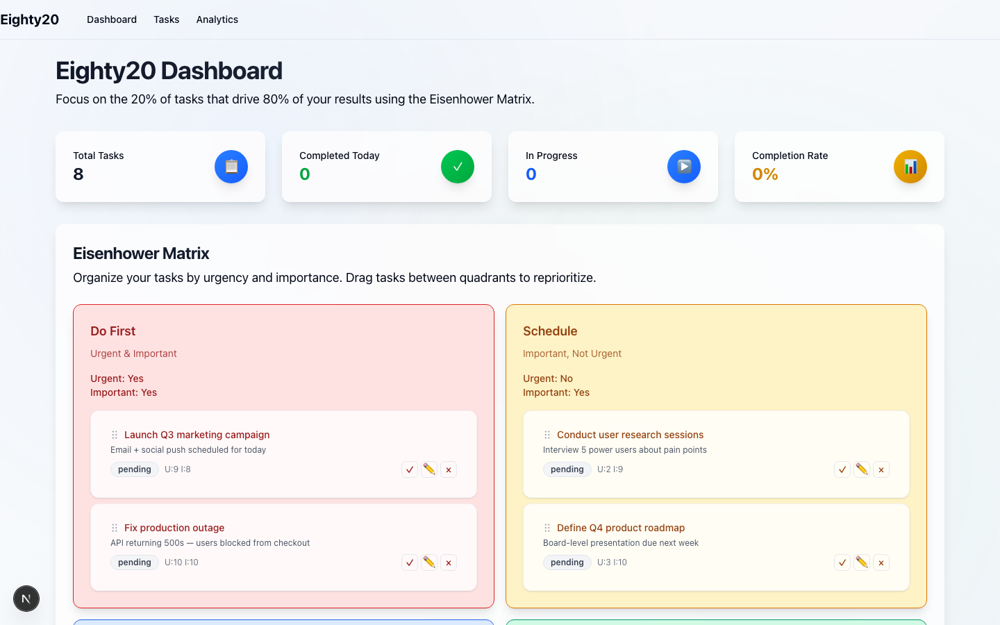
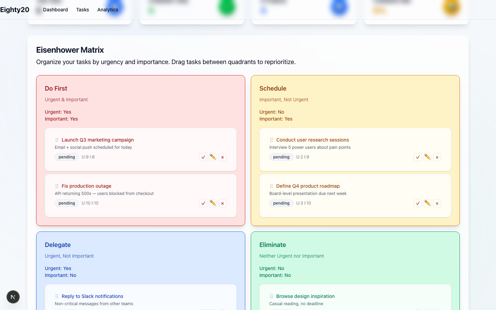
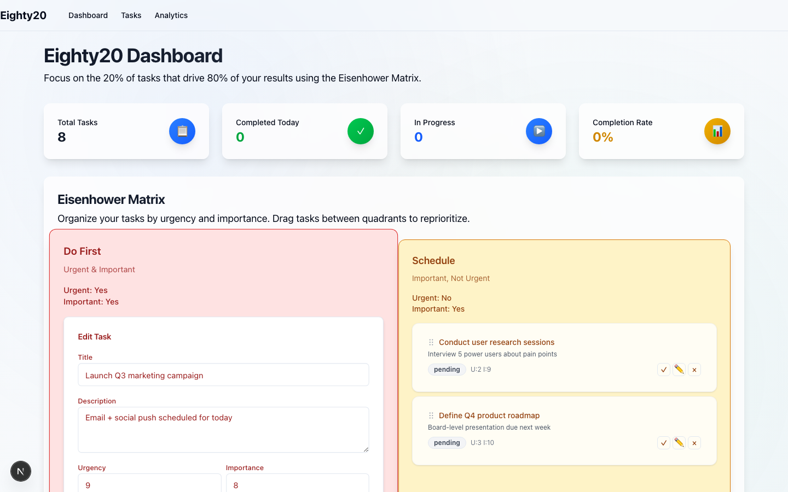
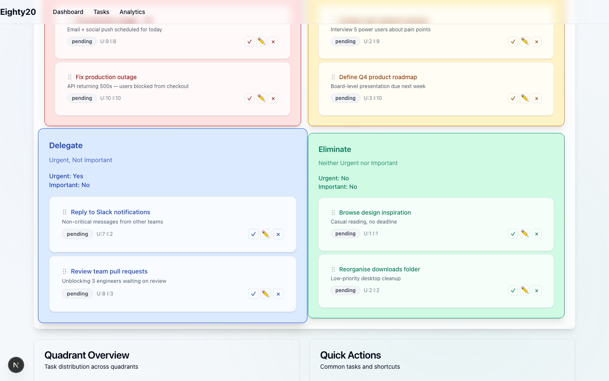
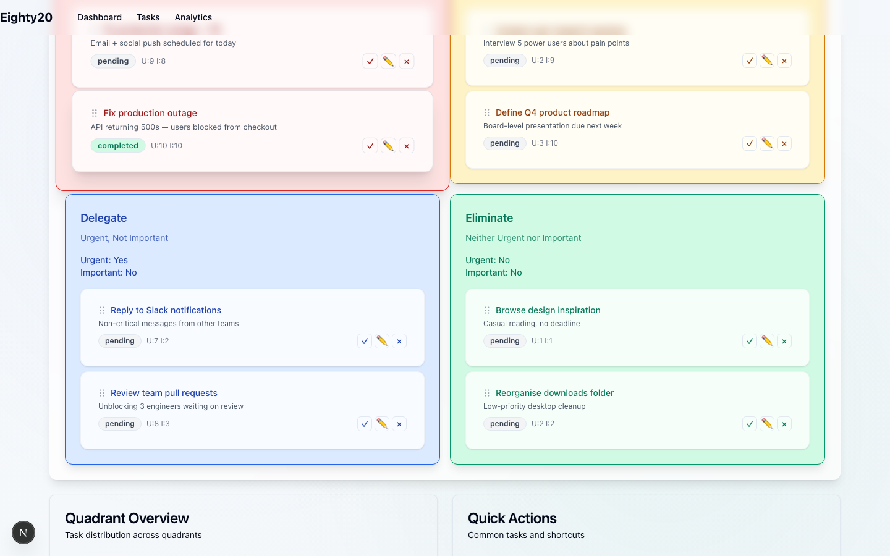
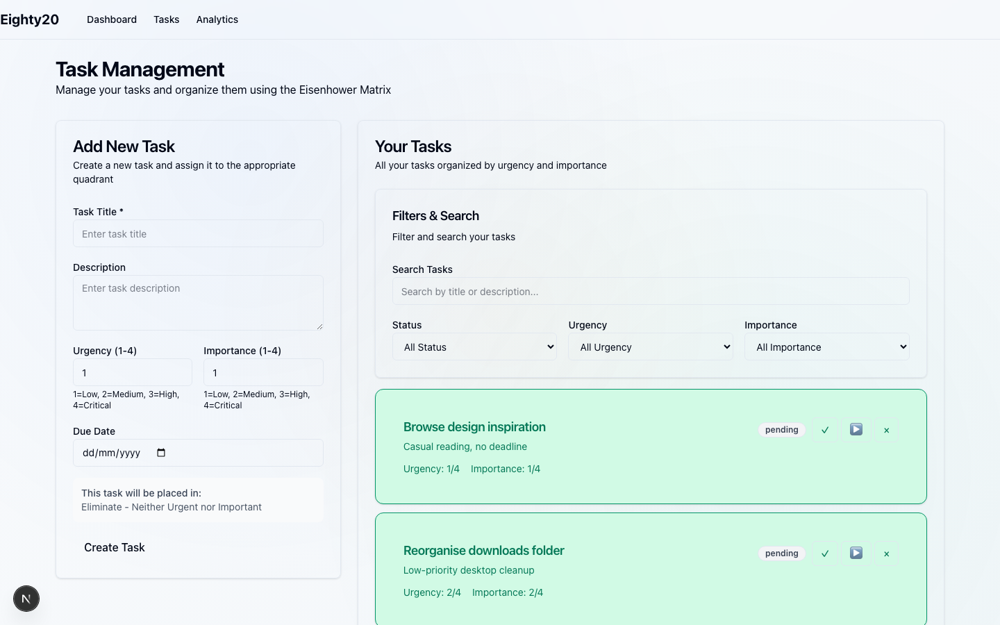
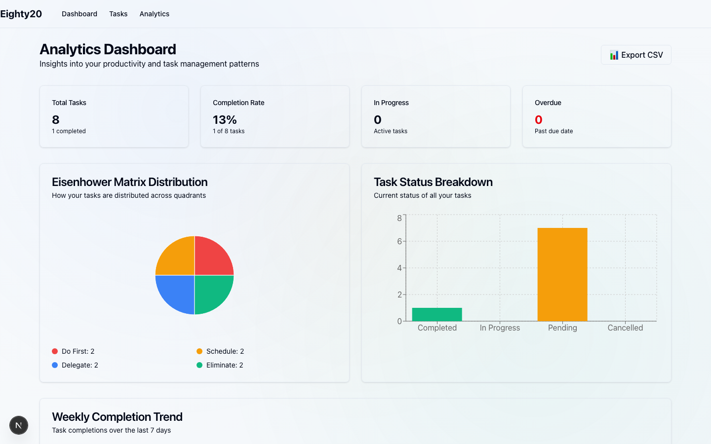

# Eighty20 — Prioritize What Matters

> **Focus on the 20% of tasks that drive 80% of your results.**

Eighty20 is a personal productivity app that fuses two of the most powerful prioritization frameworks — the **Eisenhower Matrix** and the **Pareto (80/20) Principle** — into a single, beautiful interface. Stop drowning in to-do lists. Start acting on what actually moves the needle.

---

## Why Eighty20?

Most task managers treat all tasks equally. Eighty20 doesn't.

Research shows that roughly **20% of your work produces 80% of your meaningful results**. Eighty20 forces you to confront that reality by placing every task on a 2×2 matrix of **urgency vs. importance** — giving you instant visual clarity on what to work on, what to schedule, what to delegate, and what to cut entirely.

This is not a simple to-do list. It is a **decision-making tool**.

---

## Screenshots

### Dashboard — The Command Center

Live task counts, completion rate, and the full four-quadrant matrix all on one screen. Everything you need to decide what to work on next, at a glance.



---

### Eisenhower Matrix — All Four Quadrants

Tasks auto-sort into colour-coded quadrants by urgency and importance. Each card has a **grip handle** at the top — drag it to move the task to another quadrant instantly.



| Quadrant | Label | Colour | Action |
|---|---|---|---|
| Urgent & Important | **Do First** | Red | Act on it immediately |
| Important, Not Urgent | **Schedule** | Yellow | Block time and plan it |
| Urgent, Not Important | **Delegate** | Blue | Hand it off |
| Neither | **Eliminate** | Green | Remove it from your list |

---

### Inline Editing — Right Inside the Matrix

Click the ✏️ button on any card to edit it in place. Change the title, description, urgency, importance, or due date without leaving the dashboard.



After saving, the card updates immediately — and if urgency/importance changed enough to move quadrants, it relocates automatically.



---

### One-Click Status Updates

Hit ✓ on any card to mark it completed. The badge flips to green instantly with no page reload.



---

### Task Management — Filter, Search & Create

The Tasks page gives you a filterable list alongside the creation form. Filter by status, urgency range, or importance range to zero in on exactly what you need.



---

### Analytics Dashboard — Measure Your Productivity

The Analytics page turns your task data into actionable charts:

- **Pie chart** of Eisenhower quadrant distribution
- **Bar chart** of task status breakdown (Completed / In Progress / Pending / Cancelled)
- **Line chart** of completions over the last 7 days
- **Overdue count** so nothing slips through
- **Export to CSV** for deeper analysis in your spreadsheet of choice



---

## Key Features

- **Eisenhower Matrix** — Four-quadrant visual board with drag-and-drop reordering
- **Smart Task Placement** — Real-time quadrant preview while creating a task
- **Analytics Dashboard** — Charts for quadrant distribution, status breakdown, and weekly trends
- **CSV Export** — Download all task data for offline analysis
- **Task Management** — Full CRUD with status tracking (Pending → In Progress → Completed)
- **Due Date Tracking** — Overdue tasks are surfaced automatically in analytics
- **Completion Rate** — Live percentage shown on the dashboard
- **Responsive Design** — Works on desktop, tablet, and mobile

---

## Tech Stack

| Layer | Technology |
|---|---|
| Framework | Next.js 15 (App Router, Turbopack) |
| Language | TypeScript |
| Styling | Tailwind CSS v4 |
| Database | SQLite via Prisma ORM |
| Charts | Recharts |
| Drag & Drop | dnd-kit |
| Validation | Zod |
| Deployment | Vercel |

---

## Getting Started

### Prerequisites

- Node.js 18+
- npm

### Installation

```bash
# 1. Clone the repository
git clone <repository-url>
cd Eighty20

# 2. Install dependencies
npm install

# 3. Set up the database
npx prisma migrate dev
npx prisma generate

# 4. Start the development server
npm run dev
```

Open [http://localhost:3000](http://localhost:3000) in your browser.

### Available Scripts

| Command | Description |
|---|---|
| `npm run dev` | Start dev server with Turbopack |
| `npm run build` | Production build |
| `npm run start` | Start production server |
| `npm run lint` | Run ESLint |

---

## Project Structure

```
src/
├── app/
│   ├── page.tsx              # Dashboard (Eisenhower Matrix)
│   ├── tasks/page.tsx        # Task management
│   ├── analytics/page.tsx    # Analytics dashboard
│   └── api/tasks/            # REST API routes
├── components/
│   ├── matrix/               # EisenhowerMatrix, MatrixQuadrant, TaskCard
│   ├── tasks/                # TaskForm, TaskList, TaskModal
│   └── ui/                   # Button, Card, Badge, Input, Label, Textarea
├── hooks/
│   └── useTasks.ts           # Data-fetching hook (fetch + optimistic updates)
├── lib/
│   ├── api.ts                # API client functions
│   ├── prisma.ts             # Prisma client singleton
│   └── utils.ts              # Shared utilities
└── types/
    └── index.ts              # Task types, quadrant config, helper fns
```

---

## Database Schema

```prisma
model Task {
  id          Int       @id @default(autoincrement())
  title       String
  description String?
  urgency     Int       // 1–10 scale
  importance  Int       // 1–10 scale
  status      String    // pending | in_progress | completed | cancelled
  dueDate     DateTime?
  completedAt DateTime?
  createdAt   DateTime  @default(now())
  updatedAt   DateTime  @updatedAt
  analytics   TaskAnalytics[]
}

model TaskAnalytics {
  id                Int       @id @default(autoincrement())
  taskId            Int
  timeSpent         Int?      // minutes
  impactScore       Int?      // 1–10
  satisfactionScore Int?      // 1–10
  notes             String?
  createdAt         DateTime  @default(now())
}
```

---

## Deployment

The app deploys to Vercel in one click:

1. Push your code to GitHub
2. Import the repository in Vercel
3. Vercel runs `prisma generate && next build` automatically (see `vercel.json`)

---

## Roadmap

- [x] Eisenhower Matrix with drag-and-drop
- [x] Task CRUD with status tracking
- [x] Analytics dashboard with charts
- [x] CSV export
- [x] Overdue task detection
- [ ] Task tagging and categories
- [ ] Calendar integration
- [ ] AI-powered prioritization suggestions
- [ ] Team collaboration and shared boards
- [ ] Mobile app (React Native)

---

Built with Next.js, TypeScript, Tailwind CSS, and Prisma — applying the 80/20 principle to focus on what matters most.
